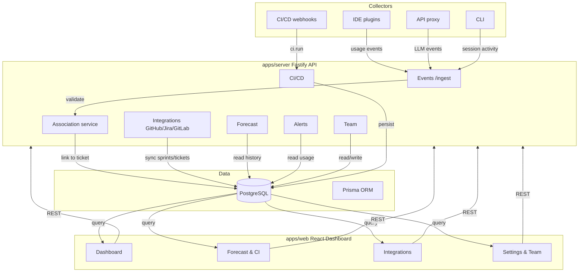
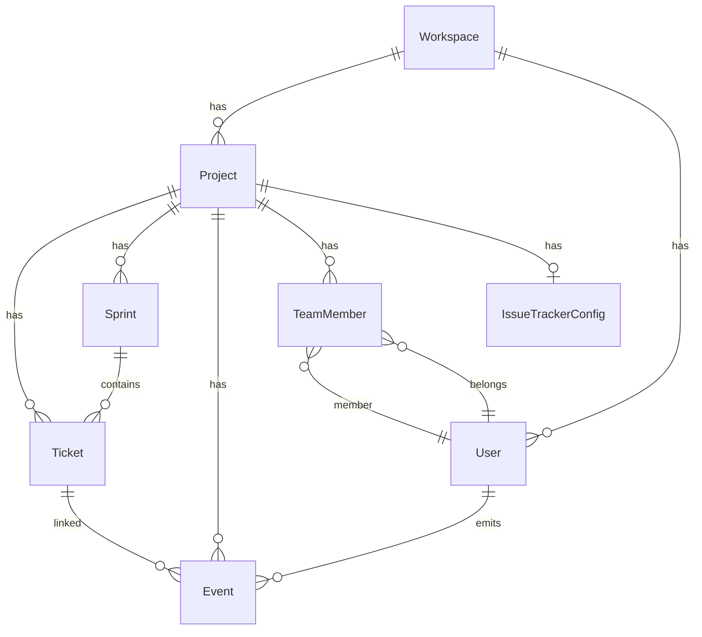
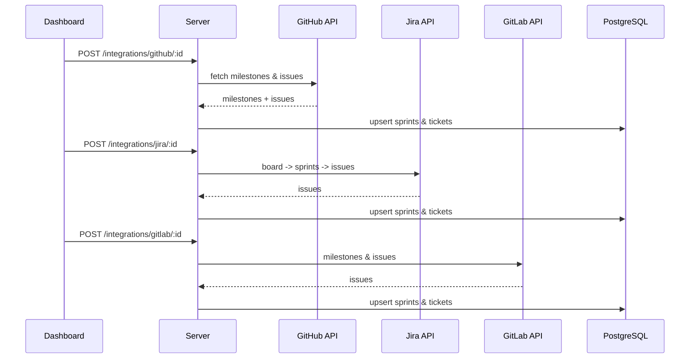
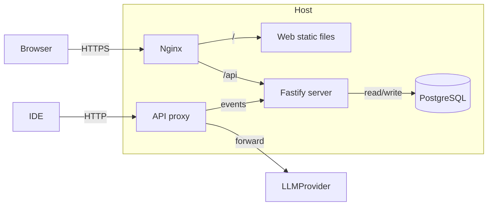

# Agile Token Sprint Architecture

This document describes the high-level architecture of the platform.

## System Overview

## Data Model

## Event Flow

1. Collectors emit events (IDE, proxy, CLI, CI)
2. Ingestion API validates the batch schema
3. Association service links events to tickets by explicit ID, prompt text, or git context
4. Events are persisted in PostgreSQL
5. Dashboard queries aggregated summaries per ticket, sprint, and project

## Integration Flow

## Components

| Component | Location | Responsibility |
|-----------|----------|----------------|
| Web dashboard | `apps/web` | React UI, Tailwind + shadcn/ui |
| Server API | `apps/server` | Fastify REST API, Prisma, integrations |
| Proxy | `apps/proxy` | Forward LLM calls, emit events |
| CLI | `apps/cli` | Wrap commands, emit session activity |
| VS Code extension | `apps/vscode` | IDE collector |
| Schema | `packages/schema` | Zod event schemas |

## Deployment

See `SELFHOST.md` for detailed deployment instructions.
