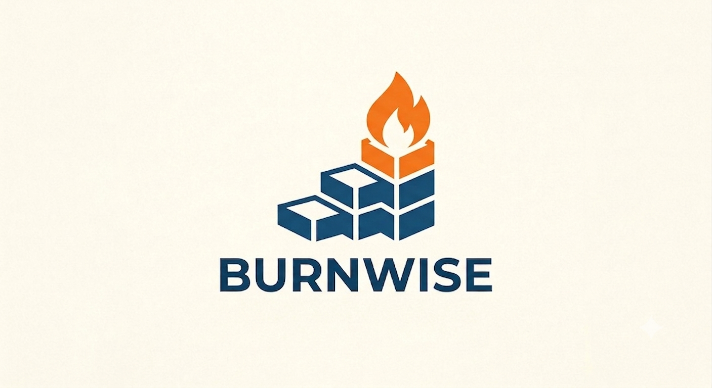
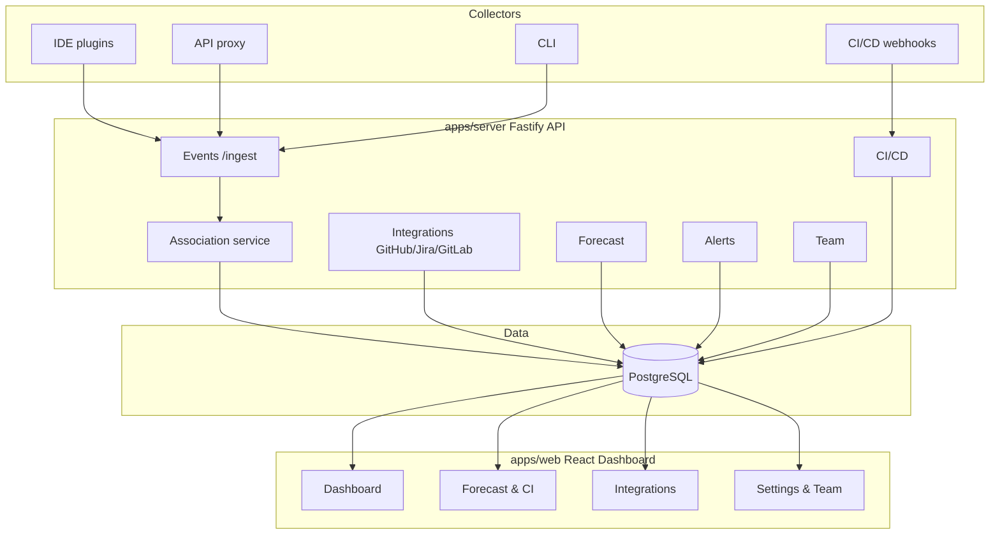

<p align="center">
  
</p>

# Burnwise

[](LICENSE)
[](https://github.com/filipjevtic/burnwise)

Self-hosted, open-source platform that turns AI usage into a first-class sprint-planning signal. Capture LLM tokens, traces, CI costs, and coding time from IDEs, API proxies, and CLI tools; associate them with Jira / GitHub / GitLab tickets; and forecast realistic workload, budget, and scope.


## What Burnwise does

- [x] **Capture effort signals** from IDE plugins, API proxies, CLI wrappers, and CI/CD pipelines.
- [x] **Associate events to tickets** by explicit ticket ID, prompt text, git branch, or commit message.
- [x] **Sync issue trackers** — GitHub Issues, Jira, and GitLab Issues become sprints and tickets.
- [x] **Forecast sprint capacity** from historical tokens, cost, and duration per story point.
- [x] **Track budgets and alerts** for tokens, cost, and CI spend per project and sprint.
- [x] **Manage teams and roles** — owner, admin, member, viewer.
- [x] **Self-host in one command** with Docker Compose.

## Quick start

```bash
# 1. Clone the repo
git clone https://github.com/filipjevtic/burnwise.git
cd burnwise

# 2. Install dependencies
npm install --workspaces --include-workspace-root

# 3. Start the database and services
docker compose up -d

# 4. Run migrations and seed demo data
npm run db:migrate --workspace=apps/server
npm run db:seed --workspace=apps/server

# 5. Start the server, proxy, and web dashboard
npm run dev --workspace=apps/server
npm run dev --workspace=apps/proxy
npm run dev --workspace=apps/web
```

Open the dashboard at http://localhost:8080.

For production deployment, see [docs/SELFHOST.md](docs/SELFHOST.md).

## Architecture

Burnwise is a monorepo of focused apps and packages.



For detailed diagrams and data model, see [docs/ARCHITECTURE.md](docs/ARCHITECTURE.md).

## Repository layout

| Path | Purpose |
|------|---------|
| `apps/web` | React dashboard (Tailwind + shadcn/ui) |
| `apps/server` | Fastify REST API, Prisma, integrations |
| `apps/proxy` | OpenAI-compatible API proxy that emits events |
| `apps/cli` | Wrap commands and emit `session.activity` events |
| `apps/vscode` | VS Code extension collector |
| `apps/mcp` | MCP server for Claude Code and other MCP clients |
| `packages/schema` | Zod event schemas shared across apps |
| `docs/` | Architecture and self-hosting documentation |
| `docker-compose.yml` | One-command local stack |

## Development

```bash
# Type-check everything
npm run typecheck --workspaces

# Build everything
npm run build --workspaces

# Run unit tests
npm run test --workspace=packages/schema

# Run E2E tests
npm run e2e --workspace=apps/web

# Run E2E in UI mode
npm run e2e:ui --workspace=apps/web
```

## Contributing

We welcome contributions. See [CONTRIBUTING.md](CONTRIBUTING.md) for guidelines.

## Security

To report a security vulnerability, please see [SECURITY.md](SECURITY.md).

## License

Apache 2.0 — see [LICENSE](LICENSE).